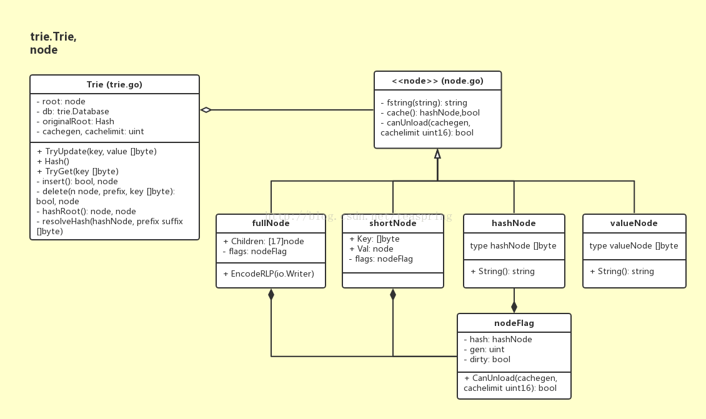
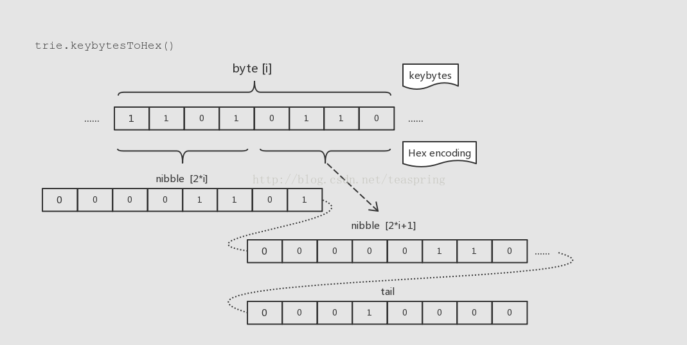
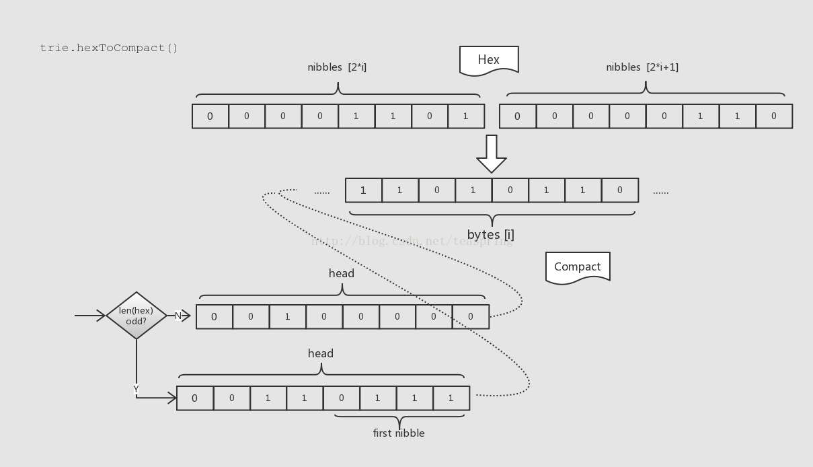

# Merkle Patricia Trie

包trie 实现了Merkle Patricia Tries，这里用简称MPT来称呼这种数据结构，这种数据结构实际上是一种Trie树变种，MPT是以太坊中一种非常重要的数据结构，用来存储用户账户的状态及其变更、交易信息、交易的收据信息。MPT实际上是三种数据结构的组合，分别是Trie树， Patricia Trie， 和Merkle树。下面分别介绍这三种数据结构。

## Trie树
Trie树，又称字典树，单词查找树或者前缀树，是一种用于快速检索的多叉树结构，如英文字母的字典树是一个26叉树，数字的字典树是一个10叉树。

Trie树可以利用字符串的公共前缀来节约存储空间。如下图所示，该trie树用10个节点保存了6个字符串：tea，ten，to，in，inn，int：


在该trie树中，字符串in，inn和int的公共前缀是“in”，因此可以只存储一份“in”以节省空间。当然，如果系统中存在大量字符串且这些字符串基本没有公共前缀，则相应的trie树将非常消耗内存，这也是trie树的一个缺点。

Trie树的基本性质可以归纳为：
* 根节点不包含字符，除根节点以外每个节点只包含一个字符
* 从根节点到某一个节点，路径上经过的字符连接起来，为该节点对应的字符串
* 每个节点的所有子节点包含的字符串不相同

## Patricia Trie
又被称为RadixTree或紧凑前缀树(compact prefix tree)，是一种空间使用率经过优化的Trie。

前缀树跟Trie树的不同之处在于Trie树给每一个字符串分配一个节点，这样将使那些很长但又没有公共节点的字符串的Trie树退化成数组。前缀树的不同之处在于如果节点公共前缀，那么就使用公共前缀，否则就把剩下的所有节点插入同一个节点。PatriciaTrie里如果存在一个父节点只有一个子节点，那么这个父节点将与其子节点合并。这样可以缩短Trie中不必要的深度，大大加快搜索节点速度。


## Merkle树
也叫哈希树(hash tree)，是密码学的一个概念，注意理论上它不一定是Trie。在哈希树中，叶子节点的标签是它所关联数据块的哈希值，而非叶子节点的标签是它的所有子节点的标签拼接而成字符串的哈希值。哈希树的优势在于，它能够对大量的数据内容迅速作出高效且安全的验证。假设一个hash tree中有n个叶子节点，如果想要验证其中一个叶子节点是否正确-即该节点数据属于源数据集合并且数据本身完整，所需哈希计算的时间复杂度是是O（log(n)），相比之下hash list大约需要时间复杂度O(n)的哈希计算，hash tree的表现无疑是优秀的。


上图展示了一个简单的二叉哈希树。四个有效数据块L1-L4，分别被关联到一个叶子节点上。Hash0-0和Hash0-1分别等于数据块L1和L2的哈希值，而Hash0则等于Hash0-0和Hash0-1二者拼接成的新字符串的哈希值，依次类推，根节点的标签topHash等于Hash0和Hash1二者拼接成的新字符串的哈希值。

哈希树最主要的应用场景是p2p网络中的数据传输。因为p2p网络中可能存在未知数目的不可信数据源，所以确保下载到的数据正确可信并且无损坏无改动，就显得非常重要。哈希树可用来解决这个问题：每个待下载文件按照某种方式分割成若干小块后，组成类似上图的哈希树。首先从一个绝对可信的数据源获取该文件对应哈希树的根节点哈希值(top hash)，有了这个可靠的top hash后，就可以开始从整个p2p网络下载文件。不同的数据部分可以从不同的源下载，由于哈希树中任意的分支树都可以单独验证哈希值，所以一旦发现任何数据部分无法通过验证，都可以切换到其他数据源进行下载那部分数据。最终，完整下载文件所对应哈希树的top hash值，一定要与我们的可靠top hash相等。

## Merkle-Patricia Trie
MPT是Ethereum自定义的Trie型数据结构。在代码中，trie.Trie结构体用来管理一个MPT结构，其中每个节点都是行为接口Node的实现类。



node接口族担当整个MPT中的各种节点，node接口分四种实现: fullNode，shortNode，valueNode，hashNode，其中只有fullNode和shortNode可以带有子节点。

* fullNode (branch node)
是一个可以携带多个子节点的父(枝)节点。它有一个容量为17的node数组成员变量Children，数组中前16个空位分别对应16进制(hex)下的0-9a-f，这样对于每个子节点，根据其key值16进制形式下的第一位的值，就可挂载到Children数组的某个位置，fullNode本身不再需要额外key变量；Children数组的第17位，留给该fullNode的数据部分。fullNode明显继承了原生trie的特点，而每个父节点最多拥有16个分支也包含了基于总体效率的考量。

* shortNode (extension node)
是一个仅有一个子节点的父(枝)节点。它的成员变量Val指向一个子节点，而成员Key是一个任意长度的字符串(字节数组[]byte)。显然shortNode的设计体现了PatriciaTrie的特点，通过合并只有一个子节点的父节点和其子节点来缩短trie的深度，结果就是有些节点会有长度更长的key。

* valueNode (leaf node)
充当MPT的叶子节点。它其实是字节数组[]byte的一个别名，不带子节点。在使用中，valueNode就是所携带数据部分的RLP哈希值，长度32byte，数据的RLP编码值作为valueNode的匹配项存储在数据库里。

这三种类型覆盖了一个普通Trie(也许是PatriciaTrie)的所有节点需求。任何一个[k,v]类型数据被插入一个MPT时，会以k字符串为路径沿着root向下延伸，在此次插入结束时首先成为一个valueNode，k会以自顶点root起到到该节点止的key path形式存在。但之后随着其他节点的不断插入和删除，根据MPT结构的要求，原有节点可能会变化成其他node实现类型，同时MPT中也会不断裂变或者合并出新的(父)节点。比如：

* 假设一个shortNode S已经有一个子节点A，现在要新插入一个子节点B，那么会有两种可能，要么新节点B沿着A的路径继续向下，这样S的子节点会被更新；要么S的Key分裂成两段，前一段分配给S作为新的Key，同时裂变出一个新的fullNode作为S的子节点，以同时容纳B，以及需要更新的A。
* 如果一个fullNode原本只有两个子节点，现在要删除其中一个子节点，那么这个fullNode就会退化为shortNode，同时保留的子节点如果是shortNode，还可以跟它再合并。
* 如果一个shortNode的子节点是叶子节点同时又被删除了，那么这个shortNode就会退化成一个valueNode，成为一个叶子节点。


### 特殊的那个 - hashNode
hashNode 跟valueNode一样，也是字符数组[]byte的一个别名，同样存放32byte的哈希值，也没有子节点。不同的是，hashNode是fullNode或者shortNode对象的RLP哈希值，所以它跟valueNode在使用上有着莫大的不同。

在MPT中，hashNode几乎不会单独存在(有时遍历遇到一个hashNode往往因为原本的node被折叠了)，而是以nodeFlag结构体的成员(nodeFlag.hash)的形式，被fullNode和shortNode间接持有。一旦fullNode或shortNode的成员变量(包括子结构)发生任何变化，它们的hashNode就一定需要更新。所以在trie.Trie结构体的insert()，delete()等函数实现中，可以看到除了新创建的fullNode、shortNode，那些子结构有所改变的fullNode、shortNode的nodeFlag成员也会被重设，hashNode会被清空。在下次trie.Hash()调用时，整个MPT自底向上的遍历过程中，所有清空的hashNode会被重新赋值。这样trie.Hash()结束后，我们可以得到一个根节点root的hashNode，它就是```此时此刻这个MPT结构的哈希值```。上文中提到的，Block的成员变量Root、TxHash、ReceiptHash的生成，正是源出于此。

明显的，hashNode体现了MerkleTree的特点：每个父节点的哈希值来源于所有子节点哈希值的组合，一个顶点的哈希值能够代表一整个树形结构。valueNode加上之前的fullNode，shortNode，valueNode，构成了一个完整的Merkle-PatriciaTrie结构，很好的融合了各种原型结构的优点，又根据Ethereum系统的实际情况，作了实际的优化和平衡。MPT这个数据结构在设计中的种种细节，的确值得好好品味。

### CODE
#### trie/node.go
定义了MPT里使用的4种数据结构。
``` go
type node interface {
	fstring(string) string
	cache() (hashNode, bool)
	canUnload(cachegen, cachelimit uint16) bool
}

type (
	fullNode struct {
		Children [17]node // Actual trie node data to encode/decode (needs custom encoder)
		flags    nodeFlag
	}
	shortNode struct {
		Key   []byte
		Val   node
		flags nodeFlag
	}
	hashNode  []byte
	valueNode []byte
)
```

#### trie/trie.go
定义了trie数据结构
``` go
// Trie is a Merkle Patricia Trie.
// The zero value is an empty trie with no database.
// Use New to create a trie that sits on top of a database.
//
// Trie is not safe for concurrent use.
type Trie struct {
	db           *Database
	root         node
	originalRoot common.Hash

	// Cache generation values.
	// cachegen increases by one with each commit operation.
	// new nodes are tagged with the current generation and unloaded
	// when their generation is older than than cachegen-cachelimit.
	cachegen, cachelimit uint16
}
```
* db
db是后端的KV存储，trie的结构最终都是需要通过KV的形式存储到数据库里面去，然后启动的时候是需要从数据库里面加载的。
* root
成员root始终作为整个MPT的根节点
* originalRoot
启动加载的时候的hash值，通过这个hash值可以在数据库里面恢复出整颗的trie树。
* cachegen
cachegen字段指示了当前Trie树的cache时代，每次调用Commit操作的时候，会增加Trie树的cache时代。 cache时代会被附加在node节点上面，如果当前的cache时代 - cachelimit参数 大于node的cache时代，那么node会从cache里面卸载，以便节约内存。 其实这就是缓存更新的LRU算法， 如果一个缓存在多久没有被使用，那么就从缓存里面移除，以节约内存空间。

#### MPT初始化
Trie树的初始化调用New函数，函数接受一个hash值和一个Database参数，如果hash值不是空值的话，就说明是从数据库加载一个已经存在的Trie树， 就调用trei.resolveHash方法来加载整颗Trie树，这个方法后续会介绍。 如果root是空，那么就新建一颗Trie树返回。
``` go
// New creates a trie with an existing root node from db.
//
// If root is the zero hash or the sha3 hash of an empty string, the
// trie is initially empty and does not require a database. Otherwise,
// New will panic if db is nil and returns a MissingNodeError if root does
// not exist in the database. Accessing the trie loads nodes from db on demand.
func New(root common.Hash, db *Database) (*Trie, error) {
	if db == nil {
		panic("trie.New called without a database")
	}
	trie := &Trie{
		db:           db,
		originalRoot: root,
	}
	if (root != common.Hash{}) && root != emptyRoot {
		rootnode, err := trie.resolveHash(root[:], nil)
		if err != nil {
			return nil, err
		}
		trie.root = rootnode
	}
	return trie, nil
}
```

#### 插入
``` go
func (t *Trie) insert(n node, prefix, key []byte, value node) (bool, node, error)
```
* n
在```n```下面插入```value```节点
* prefix
prefix是当前已经处理完的部分key
* key
是还没有处理玩的部分key, 完整的key = prefix + key
* value
是需要插入的值
* 返回值bool是操作是否改变了Trie树(dirty)，node是插入完成后的```子树```的根节点， error是错误信息

##### 插入逻辑
* 在shortNode上插入
如果被插入节点的剩余key和当前shortNode的key完全匹配，则保持当前的shortNode，只更新这个shortNode的value。
如果不完全匹配，则先生成一个fullNode(branch node)，并再生成2个shortNode，把原shortNode的子节点和被插入的节点分别挂载到新的2个shortNode，再把这两个shortNode挂载到fullNode的Children里。
如果被插入节点和shortNode完全没有匹配的key，则用新生成的fullNode代替原来的shortNode。
* 在fullNode上插入
比较简单，直接把这个节点挂载到Children的相应位置上
* 在nil上插入（其实就是新生成一个子数）
返回一个新到shortNode，key为剩余key，value为被插入节点
* hashNode
如果当前节点是hashNode, hashNode的意思是当前节点还没有加载到内存里面来，还是存放在数据库里面，那么首先调用 t.resolveHash(n, prefix)来加载到内存，然后对加载出来的节点调用insert方法来进行插入。

#### Get
Trie树的Get方法，基本上就是很简单的遍历Trie树，来获取Key的信息。
先把key []byte，zhuan
``` go
// Get returns the value for key stored in the trie.
// The value bytes must not be modified by the caller.
func (t *Trie) Get(key []byte) []byte {
	res, err := t.TryGet(key)
	if err != nil {
		log.Error(fmt.Sprintf("Unhandled trie error: %v", err))
	}
	return res
}

// TryGet returns the value for key stored in the trie.
// The value bytes must not be modified by the caller.
// If a node was not found in the database, a MissingNodeError is returned.
func (t *Trie) TryGet(key []byte) ([]byte, error) {
	key = keybytesToHex(key)
	value, newroot, didResolve, err := t.tryGet(t.root, key, 0)
	if err == nil && didResolve {
		t.root = newroot
	}
	return value, err
}

func (t *Trie) tryGet(origNode node, key []byte, pos int) (value []byte, newnode node, didResolve bool, err error) {
	switch n := (origNode).(type) {
	case nil:
		return nil, nil, false, nil
	case valueNode:
		return n, n, false, nil
	case *shortNode:
		if len(key)-pos < len(n.Key) || !bytes.Equal(n.Key, key[pos:pos+len(n.Key)]) {
			// key not found in trie
			return nil, n, false, nil
		}
		value, newnode, didResolve, err = t.tryGet(n.Val, key, pos+len(n.Key))
		if err == nil && didResolve {
			n = n.copy()
			n.Val = newnode
			n.flags.gen = t.cachegen
		}
		return value, n, didResolve, err
	case *fullNode:
		value, newnode, didResolve, err = t.tryGet(n.Children[key[pos]], key, pos+1)
		if err == nil && didResolve {
			n = n.copy()
			n.flags.gen = t.cachegen
			n.Children[key[pos]] = newnode
		}
		return value, n, didResolve, err
	case hashNode:
		child, err := t.resolveHash(n, key[:pos])
		if err != nil {
			return nil, n, true, err
		}
		value, newnode, _, err := t.tryGet(child, key, pos)
		return value, newnode, true, err
	default:
		panic(fmt.Sprintf("%T: invalid node: %v", origNode, origNode))
	}
}
```


## KEY的编码
当[k,v]数据插入MPT时，它们的k(key)都必须经过编码。
* HEX Encoding
因为fullNode.Children[]的长度是17，所以只能对应0x00-0x0f，但一个byte的范围是0x00-0xff。所以要把一个byte分成2个4bit的nibble（半字节），这样就把一个byte分成了2个byte（每个byte由nibble高位补0）。



很简单，就是将keybytes中的1byte信息，将高4bit和低4bit分别放到两个byte里，尾部接上一个可选的'终结符','终结符'代表这个节点到底是叶子节点还是扩展节点。这样新产生的key虽然形式还是[]byte，但是每个byte大小已经被限制在0x0f以内，代码中把这种新数据的每一位称为nibble。这样经过编码之后，带有[]nibble格式的key的数据就可以顺利的进入fullNode.Children[]数组了。

Hex编码虽然解决了key是keybytes形式的数据插入MPT的问题，但代价也很大，就是数据冗余。典型的如shortNode，目前Hex格式下的Key，长度会变成是原来keybytes格式下的两倍。这一点对于节点的哈希计算，比如计算hashNode，影响很大。所以Ethereum又定义了另一种编码格式叫Compact，用来对Hex格式进行优化。

* COMPACT encoding
这种编码格式就是上面黄皮书里面说到的Hex-Prefix Encoding。



如上图所示，Compact编码首先将Hex尾部标记byte去掉，然后将原本每2 nibble的数据合并到1byte；增添1byte在输出数据头部以放置Compact格式标记位；如果输入Hex格式字符串有效长度为奇数，还可以将Hex字符串的第一个nibble放置在标记位byte里的低4bit。

第一个字节的高半字节包含两个标志; 最低bit位编码了长度的奇偶位，第二低的bit位编码了flag的值。 在偶数个半字节的情况下，第一个字节的低半字节为零，在奇数的情况下为第一个半字节。 所有剩余的半字节（现在是偶数）适合其余的字节。

### CODE
#### trie/encoding.go
encoding.go主要处理trie树中的三种编码格式的相互转换的工作。
