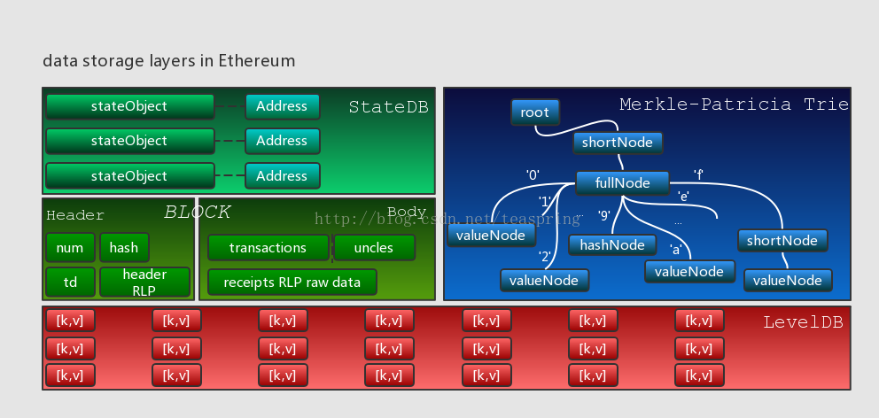

# DATA

在Ethereum的世界里，数据的最终存储形式是[k,v]键值对，目前使用的[k,v]型底层数据库是LevelDB；所有与交易，操作相关的数据，其呈现的集合形式是Block(Header)；如果以Block为单位链接起来，则构成更大粒度的BlockChain(HeaderChain)；若以Block作切割，那么Transaction和Contract就是更小的粒度；所有交易或操作的结果，将以各个个体账户的状态(state)存在，账户的呈现形式是stateObject，所有账户的集合受StateDB管理。下图描绘了上述各数据单元的层次关系：

## Block
[Block](./basic.type.Block.md)

## Merkle-Patricia Trie
[MPT](./03.Trie.md)

## ETHDB
[ETHDB](./basic.type.ethdb.md)
