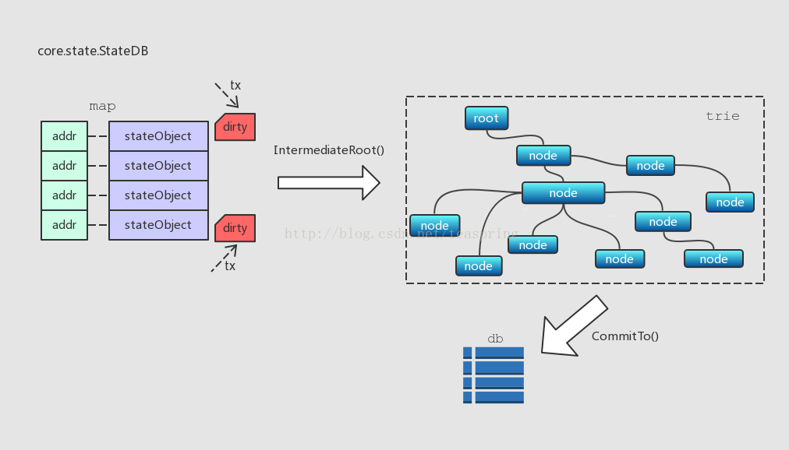
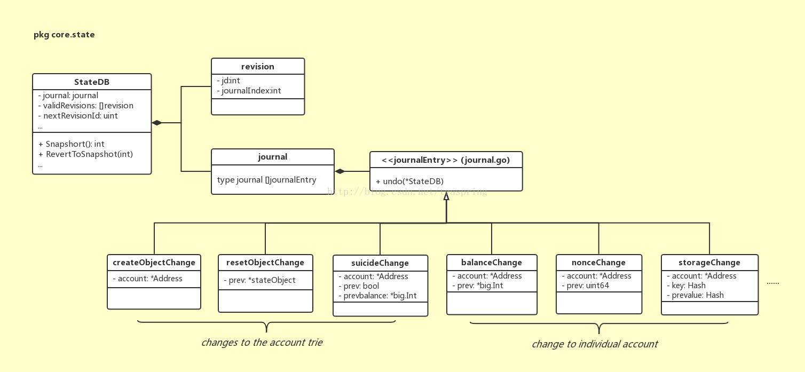
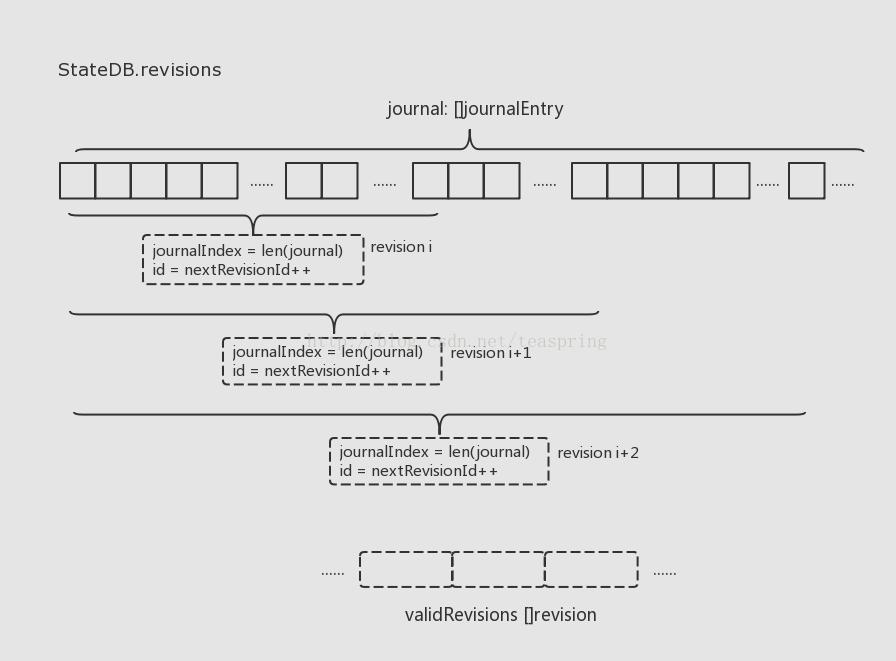

# stateDB

## 数据库的抽象层 - stateDB

系统设计中，在底层数据库模块和业务模型之间，往往需要设置本地存储模块，它面向业务模型，可以根据业务需求灵活的设计各种存储格式和单元，同时又连接底层数据库，如果底层数据库(或者第三方API)有变动，可以大大减少对业务模块的影响。

在Ethereum世界里，StateDB就担任这个角色，它通过大量的stateObject对象集合，管理所有“账户”信息。

``` go
# core/state/statedb.go

// StateDBs within the ethereum protocol are used to store anything
// within the merkle trie. StateDBs take care of caching and storing
// nested states. It's the general query interface to retrieve:
// * Contracts
// * Accounts
type StateDB struct {
	db   Database
	trie Trie

	// This map holds 'live' objects, which will get modified while processing a state transition.
	stateObjects      map[common.Address]*stateObject
	stateObjectsDirty map[common.Address]struct{}

	// DB error.
	// State objects are used by the consensus core and VM which are
	// unable to deal with database-level errors. Any error that occurs
	// during a database read is memoized here and will eventually be returned
	// by StateDB.Commit.
	dbErr error

	// The refund counter, also used by state transitioning.
	refund uint64

	thash, bhash common.Hash
	txIndex      int
	logs         map[common.Hash][]*types.Log
	logSize      uint

	preimages map[common.Hash][]byte

	// Journal of state modifications. This is the backbone of
	// Snapshot and RevertToSnapshot.
	journal        journal
	validRevisions []revision
	nextRevisionId int

	lock sync.Mutex
}
```
* db
后端的数据库

* trie
StateDB有一个trie.Trie类型成员trie，它又被称为storage trie或stte trie，这个MPT结构中存储的都是stateObject对象，每个stateObject对象以其地址(20 bytes)作为插入节点的Key；每次在一个区块的交易开始执行前，trie由一个哈希值(hashNode)恢复出来。

* stateObjects
另外还有一个map结构，也是存放stateObject，每个stateObject的地址作为map的key。

* stateObjectsDirty
用来缓存被修改过的stateObject

* refund
暂不清楚功能

* thash
当前的transaction hash

* bhash
当前的block hash

* txIndex
当前的交易的index

* logs
日志 key是交易的hash值

* preimages
EVM计算的 SHA3->byte[]的映射关系

* journal
状态修改日志

### 这些数据结构之间是怎样的关系呢？



如上图所示，每当一个stateObject有改动，亦即“账户”信息有变动时，这个stateObject对象会更新，并且这个stateObject会标为dirty，此时所有的数据改动还仅仅存储在map里。当IntermediateRoot()调用时，所有标为dirty的stateObject才会被一起写入trie。而整个trie中的内容只有在CommitTo()调用时被一起提交到底层数据库。可见，这个stateObjects map被用作本地的一级缓存，trie是二级缓存，底层数据库是第三级，各级数据结构的界限非常清晰，这样逐级缓存数据，每一级数据向上一级提交的时机也根据业务需求做了合理的选择。

## StateDB中账户状态的版本管理

StateDB还可以管理账户状态的版本。这个功能用到了几个结构体：journal，revision。



### journal

journal代表了操作日志，是一个journalEntry的数组， 并针对各种操作的日志提供了对应的回滚功能。 可以基于这个日志来做一些事务类型的操作。每进行一次操作，就会往state.journal append一个journalEntry。

接口journalEntry存在若干种实现体，描述了从单个账户操作(账户余额，发起合约次数等)，到account trie变化(创建新账户对象，账户消亡)等各种最小事件。

journal的作用就是为了回滚stateDB用的，在每次```Commit```或者```IntermediateRoot```的时候，journal都会被清空。

``` go
# core/state/journal.go
type journalEntry interface {
	undo(*StateDB)
}

type journal []journalEntry
```

#### journal的类型
以下这些journal类型，都实现了journalEntry接口。

##### Changes to the account trie (storage trie)

* createObjectChange
创建一个stateObject

* resetObjectChange
重置一个stateObject

* suicideChange
删除账号

##### Changes to individual accounts

* balanceChange
* nonceChange
* storageChange
* codeChange

##### Changes to other state values
* refundChange
* addLogChange
* addPreimageChange
* touchChange

### revision

revision结构体，用来描述一个‘版本’，它的两个整型成员id和journalIndex，都是基于journal数组进行操作的。

使用```stateDB.Snapshop()```来生成一个新的stateDB的版本。可以使用```stateDB.RevertToSnapshot()```恢复到某个特定版本。

``` go
# core/state/statedb.go

type revision struct {
	id           int
	journalIndex int
}
```



上图简述了StateDB中账户状态的版本是如何管理的。首先journal数组会随着系统运行不断的增长，记录所有发生过的单位事件；当某个时刻需要产生一个账户状态版本时，代码中相应的是Snapshop()调用，会产生一个新revision对象，记录下当前journal散列的长度，和一个自增1的版本号。

基于以上的设计，当发生回退要求时，只要根据相应的revision中的journalIndex，在journal数组上，根据所记录的所有journalEntry，即可使所有账户回退到那个状态。

``` go
// Snapshot returns an identifier for the current revision of the state.
func (self *StateDB) Snapshot() int {
	id := self.nextRevisionId
	self.nextRevisionId++
	self.validRevisions = append(self.validRevisions, revision{id, len(self.journal)})
	return id
}

// RevertToSnapshot reverts all state changes made since the given revision.
func (self *StateDB) RevertToSnapshot(revid int) {
	// Find the snapshot in the stack of valid snapshots.
	idx := sort.Search(len(self.validRevisions), func(i int) bool {
		return self.validRevisions[i].id >= revid
	})
	if idx == len(self.validRevisions) || self.validRevisions[idx].id != revid {
		panic(fmt.Errorf("revision id %v cannot be reverted", revid))
	}
	snapshot := self.validRevisions[idx].journalIndex

	// Replay the journal to undo changes.
	for i := len(self.journal) - 1; i >= snapshot; i-- {
		self.journal[i].undo(self)
	}
	self.journal = self.journal[:snapshot]

	// Remove invalidated snapshots from the stack.
	self.validRevisions = self.validRevisions[:idx]
}
```
