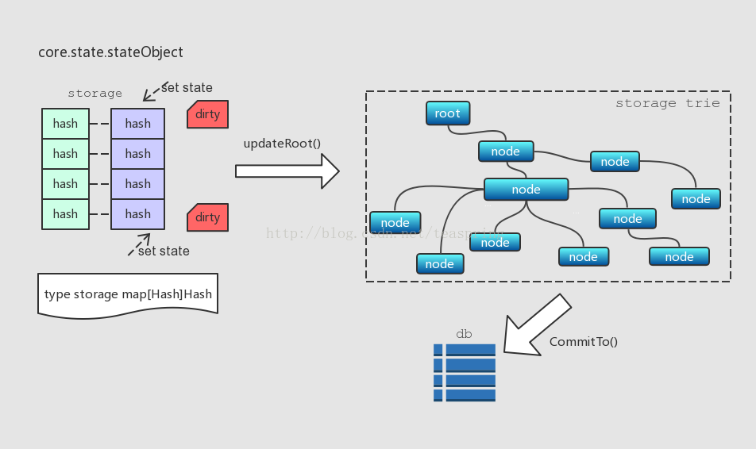

# stateObject
每个stateObject对象管理着Ethereum世界里的一个“账户”。stateObject有一个成员变量data，类型是Account结构体，里面存有账户Ether余额，合约发起次数，最新发起合约指令集的哈希值，以及一个MPT结构的顶点哈希值。

core/state/state_object.go

``` go
// Account is the Ethereum consensus representation of accounts.
// These objects are stored in the main account trie.
type Account struct {
	Nonce    uint64
	Balance  *big.Int
	Root     common.Hash // merkle root of the storage trie
	CodeHash []byte
}
```

stateObject内部也有一个Trie类型的成员trie，被称为storage trie，它里面存放的是一种被称为State的数据。State跟每个账户相关，格式是[Hash, Hash]键值对。有意思的是，stateObject内部也有类似StateDB一样的二级数据缓存机制，用来缓存和更新这些State。

``` go
// stateObject represents an Ethereum account which is being modified.
//
// The usage pattern is as follows:
// First you need to obtain a state object.
// Account values can be accessed and modified through the object.
// Finally, call CommitTrie to write the modified storage trie into a database.
type stateObject struct {
	address  common.Address
	addrHash common.Hash // hash of ethereum address of the account
	data     Account
	db       *StateDB

	// DB error.
	// State objects are used by the consensus core and VM which are
	// unable to deal with database-level errors. Any error that occurs
	// during a database read is memoized here and will eventually be returned
	// by StateDB.Commit.
	dbErr error

	// Write caches.
	trie Trie // storage trie, which becomes non-nil on first access
	code Code // contract bytecode, which gets set when code is loaded

	cachedStorage Storage // Storage entry cache to avoid duplicate reads
	dirtyStorage  Storage // Storage entries that need to be flushed to disk

	// Cache flags.
	// When an object is marked suicided it will be delete from the trie
	// during the "update" phase of the state transition.
	dirtyCode bool // true if the code was updated
	suicided  bool
	touched   bool
	deleted   bool
	onDirty   func(addr common.Address) // Callback method to mark a state object newly dirty
}
```



stateObject定义了一种类型名为storage的map结构，用来存放[]Hash,Hash]类型的数据对，也就是State数据。当SetState()调用发生时，storage内部State数据被更新，相应标示为"dirty"。之后，待有需要时(比如updateRoot()调用)，那些标为"dirty"的State数据被一起写入storage trie，而storage trie中的所有内容在CommitTo()调用时再一起提交到底层数据库。
